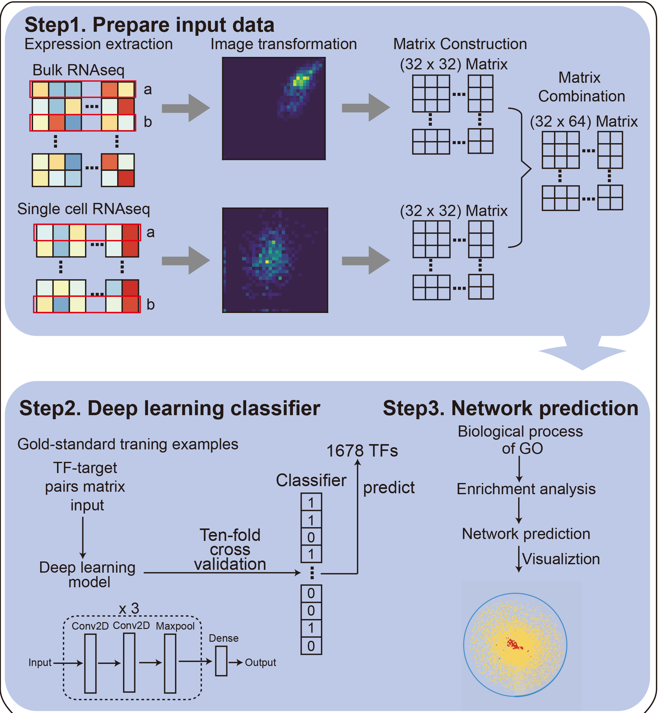
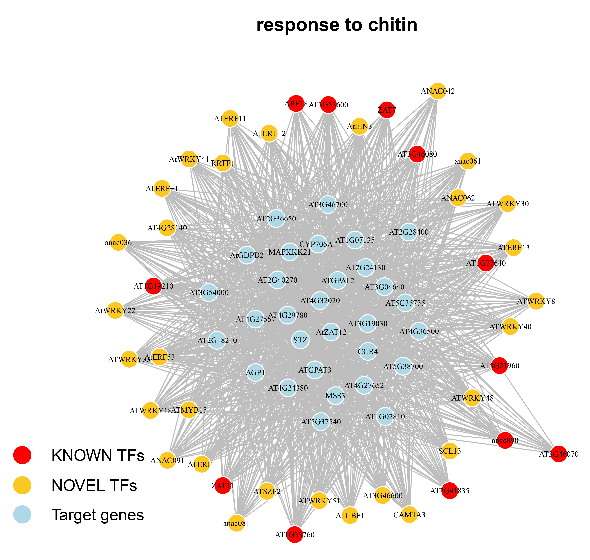
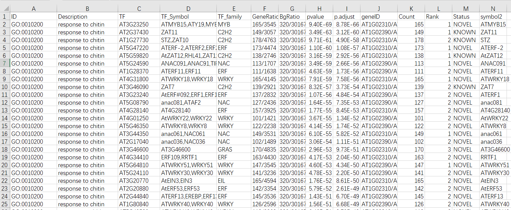
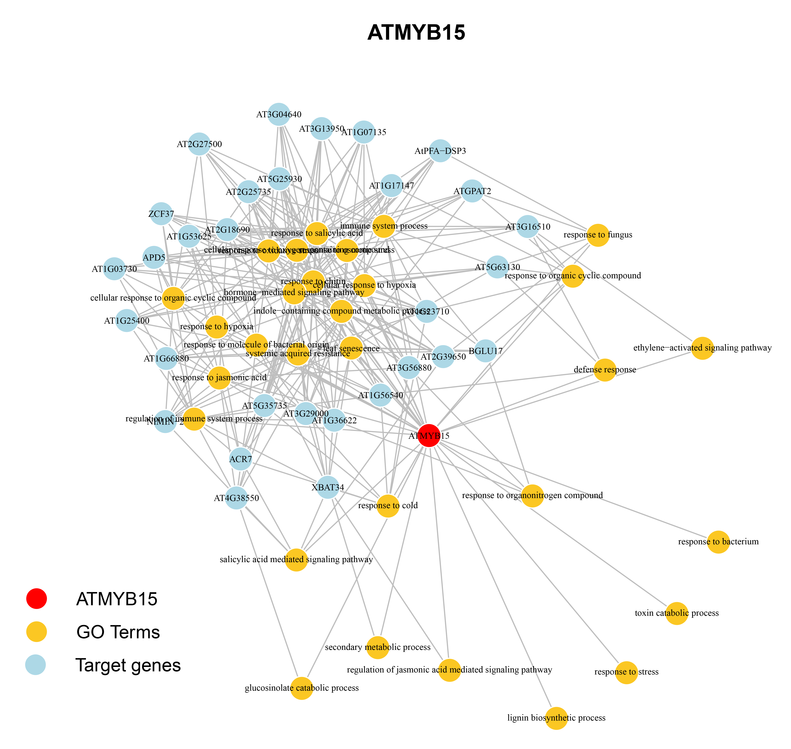
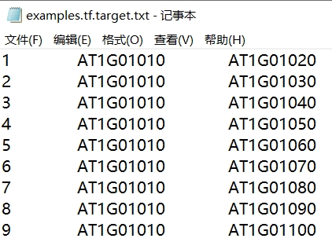
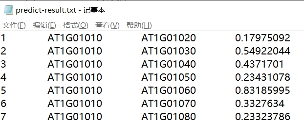

# DEGRN

**DEGRN** (**D**eep-learning on **E**xpression for **G**ene **R**egulatory **N**etwork) was a nenural model which was built by training on the expression data of bulk RNA-seq and scRNA-seq in plants. DEGRN obtained 3,053,363 high-quality interactions composited with 1,430 TF genes and 13,739 non-TF genes in *Arabidopsis thaliana*. Based on these interactions, users can infer the gene functions for each TF, and construct the network for a specific function.

Along with DEGRN, users can do:
1. seek on a interested functions (or BPs) for more associated TF genes;
2. seek on a interested TsF for more functions including KNOWN functions (or BPs) and NOVEL functions (or BPs);
3. predict the interested TFs and targets based on DEGRN.
4. train the user's own datasets to build personl DEGRN for predicting the novel network in need.

## Contens
- [Install](https://github.com/guocc212/DEGRN#Install)
- [Usage](https://github.com/guocc212/DEGRN#Usage)
- [Reference](https://github.com/guocc212/DEGRN#Reference)

---
## Install 
- This model was written in [Python](https://www.python.org/). So, you need to install [Python](https://www.python.org/). The modules of python include ```keras```, ```numpy```, ```matplotlib```, and ```pandas```. 
- If you need to plot the network, the [R](https://www.r-project.org/) need to be installed. The R packages ```igraph```, ```dplyr```, ```data.table``` are also required. 



---
## Usage
### 1. Download **DEGRN**
```
git clone https://github.com/guocc212/DEGRN.git
```
The commond will download the whole data of the DEGRN, including three directory: data, examples, models. 


### 2. obtained the results of DEGRN for interested TFs or intersted gene functions

For the convenience of users, we make a pipeline of function, named as ```DEGRN_plot_pipeline``` in R script ```plot_network_for_DEGRN.R```, which can use for visuallization of specific TFs or specific gene functions. Users only need to load the Rscript ```plot_network_for_DEGRN.R``` to use these combined functions. 

The function ```DEGRN_plot_pipeline``` currently contain <font color=red>8</font> parameters. 
For example,
````R
DEGRN_plot_pipeline(modes = "go", go = NULL, gene = NULL, out.prefix=nULL,go.number = NULL, tf.number = NULL, target.number = NULL,cols = NULL)
````
The parameters of ```DEGRN_plot_pipeline``` are as followed:
- ```modes``` - The parameter for TFs or functions, only two choice: ```1. gene``` means it was used for visuallization for TFs; ```2. go``` means it was used for visuallization for functions.
- ```go```- The Description of the interested function. For exmaple, ```response to chitin```. It should be used accompanied by ```modes = "go"```. 

- ```gene```- The gene ID (AGI) of the interested TFs. For exmaple, ```AT3G23250```. It should be used accompanied by ```modes = "gene"```. 
```out.prefix```- The prefix of results. If it was default as "NULL", then the ```out.prefix``` will automatically be set as the gene ID or function name.
- ```go.number ```- The number of GO terms shown in the graph of the network. It should be used accompanied by ```modes = "go"```. 
- ```tf.number ```- The number of NOVEL TFs shown in the graph of the network. It should be used accompanied by ```modes = "gene"```. 
- ```tf.number ```- The number of targets TFs shown in the graph of the network.
- ```cols ```- The color used in the graph of the network. Usually, it should be three colors. 

---

#### (1). For the interested gene functions (BPs)
The commands were used to plot the network of the interested function (BP of GO) based on the results from the DEGRN. For example, here, we choose the function ```"response to chitin"``` belonging to abiotic stress. You can open a R console to type the following commands:
```R
# R code
# Step 1. load the scripts of functions for DEGRN
source("plot_network_for_DEGRN.R")

# Step 2. select the interested gene functions from DEGRN
# for example: response to chitin
# we choose the GO, named as "response to chitin", to show the potential network predicted from the DEGRN. 
# Firstly, we select the modes = "go", and add the go="response to chitin" with the parameter of 30 NOVEL TFs and top 30 of the most enriched target genes.
DEGRN_plot_pipeline(modes = "go", go="response to chitin", tf.number = 30, target.number = 30)

```
After the commands running, we will got the graph of ```"response to chitin"``` network, in which ```red dots``` represents the interested TF as we set;  the ```yellow dots``` represent the predicted functions by DEGRN; the ```light blue dots``` represent the targets gene of TFs predicted by DEGRN.




Apart from the graph of network, it will also make out an ```excel``` file containing the whole information of this specific go. If you don't set the ```out.prefix``` parameter, the prefix of excel file was set by the go term name, which was chang the ```blank``` to ```_```. 

For example, here, we use the GO ```response to chitin```, and the prefix will be ```response_to_chitin``` and the whole name of the excel file will be ```response_to_chitin.predicted_TFs.xls```. 

The results file ```response_to_chitin.predicted_TFs.xls``` lists the whole potential TFs which was involved in this GO, including the ```KNOWN``` TFs with this annotation, and the ```NOVEL``` TFs without this annotation. Here is an example: 



**In this result file, columns are as followed:**

- ```ID```-                The GO ID of the GO annotations
- ```Description```-       The descriptions of GO terms, representing the gene functions
- ```TF```-                The predicted TF gene ID (AGI) predicted by DEGRN
- ```TF_Symbol```-         The predicted TF gene symbol predicted by DEGRN
- ```TF_family```-         The family of the predicted TF gene symbol classfied
- ```GeneRatio```-         The ratio of the targets predicted by DEGRN which contain this GO, divided by the total number of the targets predicted by DEGRN
- ```BgRatio```-           The ratio of the total number of genes containing this GO, divided by the total number of the genes exists in Arabidopsis genome
- ```pvalue```-            The pvalue calculate by the hypergeometric distribution
- ```p.adjust```-          The adjusted pvalue by BH methods 
- ```geneID```-            The total targets ID (AGI) which were enriched in this GO
- ```Count```-             The number of targets enriched in this GO
- ```Rank```-              The rank of this GO in the according TF, which was sorted by the pvalue
- ```Status```-            The detail of GO annotations whether it was annotated
- ```symbol2```-           The simplified gene symbol for TFs which was shown in the network


#### (2). For the interested TF genes

Similar as the above, it can be used for prediction of novel gene functions for specifc TF. Here, we use TF AT3G23250 (ATMYB15) as an example. You can open a R console to type the following commands:

```R
# R code
# Step 1. load the scripts of functions for DEGRN
source("plot_network_for_DEGRN.R")

# Step 2. choose the interested TFs from DEGRN.
# for example: AT3G23250 (ATMYB15)
# Difference with above: "modes" was changed to "gene", and the gene was set by the parameter "gene".
# Also, it change the "tf.number" to "go.number".
DEGRN_plot_pipeline(modes = "gene", gene="AT3G23250", go.number = 30, target.number = 30)

```

Here is an example of network which was constructed by ```ATMYB15```.



---

### 3. Predict the interested TFs and targets based on DEGRN

The Python script ```predict_tf_target_file_from_DEGRN.py``` is used to predict the interactions for users. Users can make a predict input file, includint three columns: ID, tf, target.

For example, the file ```examples/examples.tf.target.txt``` list 6 paris of tf and target. 



Thus, open a command line window or shell terminal, navigate to the home directory of DEGRN pcakage, and type in the following command:

```bash
# bash code in Linux or CMD code in Window
python predict_tf_target_file_from_DEGRN.py examples/scRNA-seq.tpm.txt examples/bulk_RNA-seq.tpm.txt models/whole_data_model.h5 examples/examples.tf.target.txt examples/predict-result.txt
```

The resulted file ```examples/predict-results.txt``` are as followed:



- The ```1th``` column was index, which is same as the input file
- The ```2th``` column was TF ID, which is same as the input file
- The ```3th``` column was target ID, which is same as the input file
- The ```4th``` column was score predicted by DEGRN


